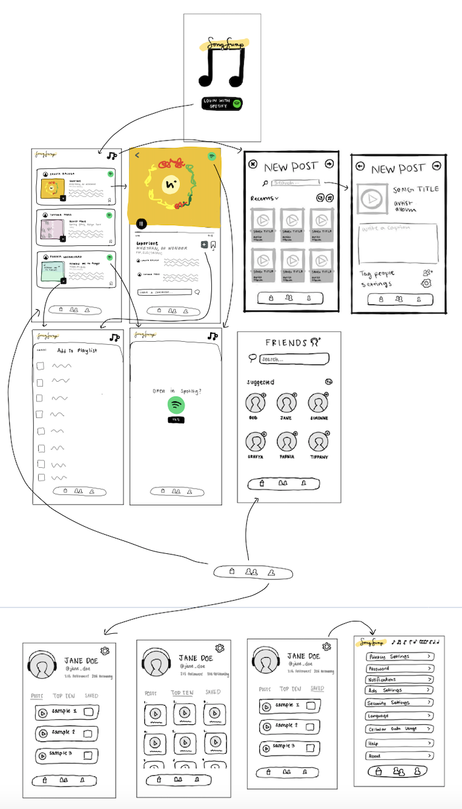

# SongSwap

## Table of Contents
1. [Overview](#Overview)
1. [Product Spec](#Product-Spec)
1. [Wireframes](#Wireframes)
2. [Schema](#Schema)

## Overview
### Description
**SongSwap** is an application that allows users to maintain a social media feed explicitly for music via the Spotify API. It will allow users to post songs they enjoy, see and comment on the songs that their friends have posted and see their friends' top songs! All music will be streamed natively in the application and the music found on the platform can be added to playlists natively as well. Additionally, we hope to implement a "Song of the Day" feature to further showcase the design team's love of music. 

- **Category:** Social, Entertainment, Music
- **Mobile:** This app would be originally developed on mobile, much like other social media applications (Instagram, Twitter, etc.)
- **Story:** Music is a large part of building relationships and connecting with others. Our app will allow people to easily share music with their friends rather than using a messaging app where they can only send links. 
- **Market:** Any Spotify user can use this app. Ability to follow friends and view their suggested songs allows the users to socially connect with others through music.
- **Habit:** This app can be used as often as the user would like, depending on when they want to view their friends' suggested songs and share their current music interests. We assume there will be a wide range of potential rates of viewing as we hope to make our platform similar to many other social media platforms. 
- **Scope:** First we would start with building the posting ability and a feed to see and comment music your friends have shared. Then we would add extra features like generating a playlist based off of your friends' recent songs, listing your current top 10 songs on your profile, and getting a random song of the day.

## Product Spec

### User Stories (Required and Optional)

**Required Must-have Stories**

- [x] User can login to the application - **SPRINT 1**


* User searches for and adds friends
* User customizes their profile page with favorite songs
- [x] User searches for and posts a song they like to share with their friends - **SPRINT 2**


* User comments on a friend's post
* User plays a song their friend shared natively in the app
* User adds a song their friend shared to their own playlist
* User can view a feed of all the songs their friends have shared

**Optional Nice-to-have Stories**

* User generates playlist based off of their friends recent songs
* User views current top 10 songs on their profile (public) - Using Spotify API
* User can be recommended a random song of the day!
* User sends a song they want to recommend to a friend
* User can edit their app-wide and profile settings

### Screen Archetypes

* Login Screen
    * User signs up or logs into their account
* Find Friends Screen
    * User can search for friends to follow
* Create Post
    * Search Screen
        * User can search for a song to post
    * Details & Confirmation Screen
        * User can write a caption and share it to their followers
* Friend Feed Screen
    * User can scroll through their feed and play songs
    * User can save posts
    * User can add songs to a playlist
    * User can open song on Spotify
* Post Details Screen
    * User can comment on their friends post
    * User can scroll through comments on their friends' post
    * User can play full song instead of snippet
* Profile Screen
    * User can view their music profile
    * User can see their saved posts
    * User can see their shared posts
    * User can see their top 10 song
    * User can see their followers and following
* Settings Screen
    * User can edit their app-wide and profile settings

### Navigation

**Tab Navigation** (Tab to Screen)

* Friend Feed
* Find Friends
* Profile

**Flow Navigation** (Screen to Screen)

* Friend Feed
    * Create Post
        * Search
        * Details
    * Post Details
    * Open song on Spotify
    * Add to playlist
* Profile
    * Followers
    * Following
    * Shared posts
    * Top 10 Songs
    * Saved posts

## Wireframes


## Schema 
### Models


### Networking
* Login Screen
   * (GET)(External) User logs in through Spotify API
* Find Friends Screen
   * (GET)(External) User searches for friends by Spotify display name
* Create Post
   * Search Screen
      * (GET)(External) User searches for Spotify song by title
   * Details & Confirmation Screen
      * (POST) User creates a new post
         ```
        let post = PFObject(className:"Posts")
        ...
        post.saveInBackground { (success, error) in
            if success {
               ...
            } else {
                print(error!)
            }
        }
         ``` 
* Friend Feed Screen
   * (GET)(External) User listens to songs as they scroll (via posts table)
   * (GET) User sees posts on their feed
      * Find list of followers
      * Find all posts from followers
         * Find whether posts are liked or not
      * Order by time (descending)
   * (POST) User can save posts from their feed to their saved library
       ```
        let like = PFObject(className:"Likes")
        ...
        like.saveInBackground { (success, error) in
            if success {
               ...
            } else {
                print(error!)
            }
        }
        ``` 
   * (POST)(External) User can add songs to a Spotify playlist
   * (GET)(External) User can open song on Spotify through their API
* Post Details Screen
   * (POST) User comments on their friends post
       ```
        let comment = PFObject(className:"Comments")
        ...
        comment.saveInBackground { (success, error) in
            if success {
               ...
            } else {
                print(error!)
            }
        }
        ``` 
   * (GET) User views comments on their friends' post
       ```
         let query = PFQuery(className:"Comments")
         query.whereKey("post", equalTo: currentPost)
         query.order(byDescending: "time")
         query.findObjectsInBackground { (comments: [PFObject]?, error: Error?) in
            if let error = error {
               print(error.localizedDescription)
            } else if let comments = comments {
               print("Successfully retrieved \(comments.count) comments.")
               ...
            }
         }
        ``` 
   * (GET)(External) User plays full song instead of snippet
* Profile Screen
   * (GET) User sees their saved posts
        ```
         posts = []
         let query = PFQuery(className:"Likes")
         query.whereKey("user", equalTo: currentUser)
         query.findObjectsInBackground { (comments: [PFObject]?, error: Error?) in
            if let error = error {
               print(error.localizedDescription)
            } else if let likes = likes {
               for like in likes {
                  let query = PFQuery(className:"Posts")
                  query.whereKey("id", equalTo: like["post"])
                  ...
                  posts.append(post)
                  ...
               }
            }
         }
       ``` 
   * (GET) User sees their shared posts
        ```
         let query = PFQuery(className:"Posts")
         query.whereKey("user", equalTo: currentUser)
         query.order(byDescending: "time")
         query.findObjectsInBackground { (posts: [PFObject]?, error: Error?) in
            if let error = error {
               print(error.localizedDescription)
            } else if let posts = posts {
               print("Successfully retrieved \(posts.count) posts.")
               ...
            }
         }
        ``` 
   * (GET)(External) User sees their top 10 songs
   * (GET) User sees their followers
        ```
         let query = PFQuery(className:"Followers")
         query.whereKey("followed", equalTo: currentUser)
         query.findObjectsInBackground { (f: [PFObject]?, error: Error?) in
            if let error = error {
               print(error.localizedDescription)
            } else if let f = f {
               print("Successfully retrieved \(f.count) f.")
               ...
            }
         }
        ``` 
   * (GET) User sees accounts they follow
        ```
         let query = PFQuery(className:"Followers")
         query.whereKey("following", equalTo: currentUser)
         query.findObjectsInBackground { (f: [PFObject]?, error: Error?) in
            if let error = error {
               print(error.localizedDescription)
            } else if let f = f {
               print("Successfully retrieved \(f.count) f.")
               ...
            }
         }
        ``` 
* Settings Screen
   * (GET) User’s sees their current settings
      * Settings table TBD 
   * (PUT) User edits their app-wide and profile settings
      * Settings table TBD 
